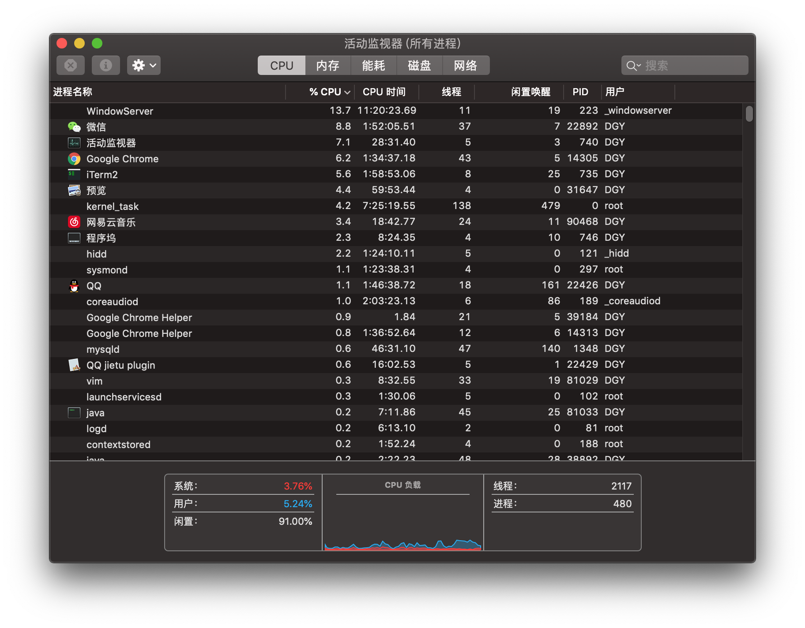
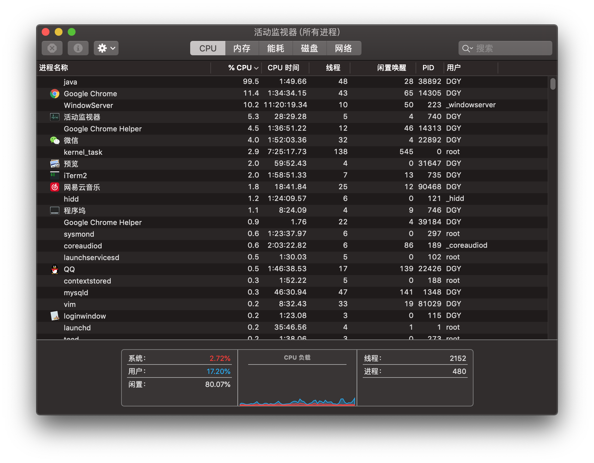
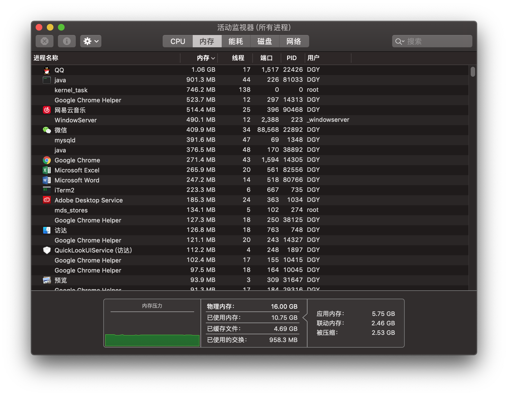
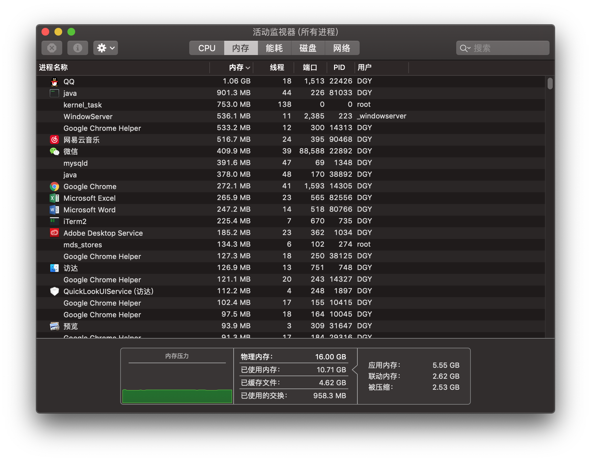
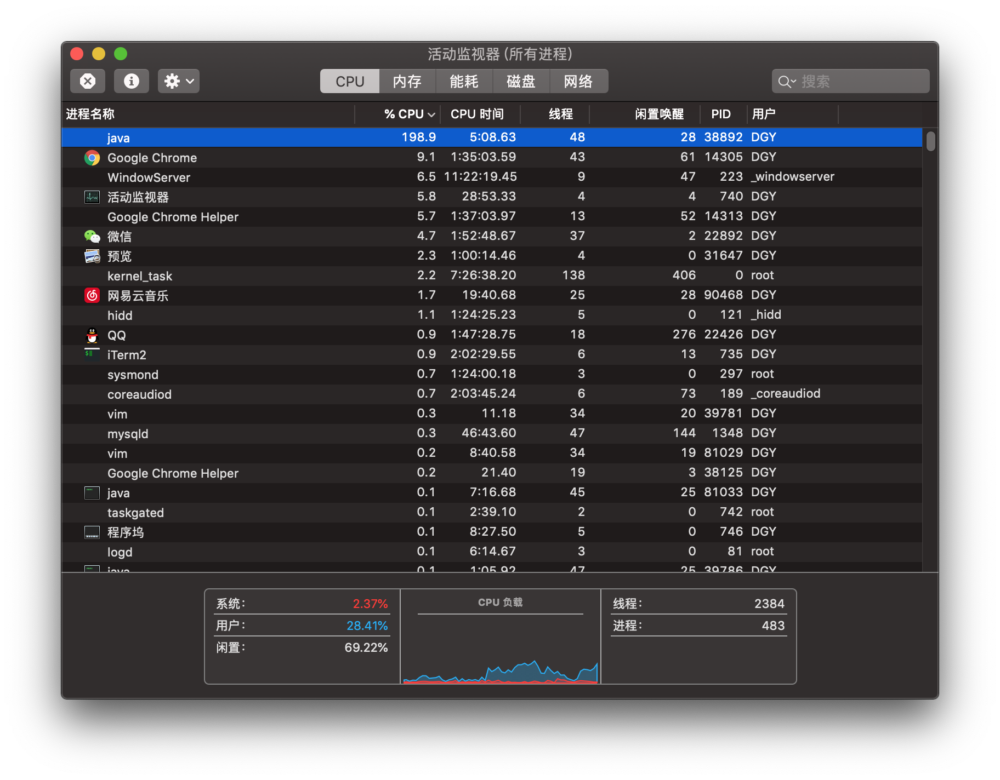
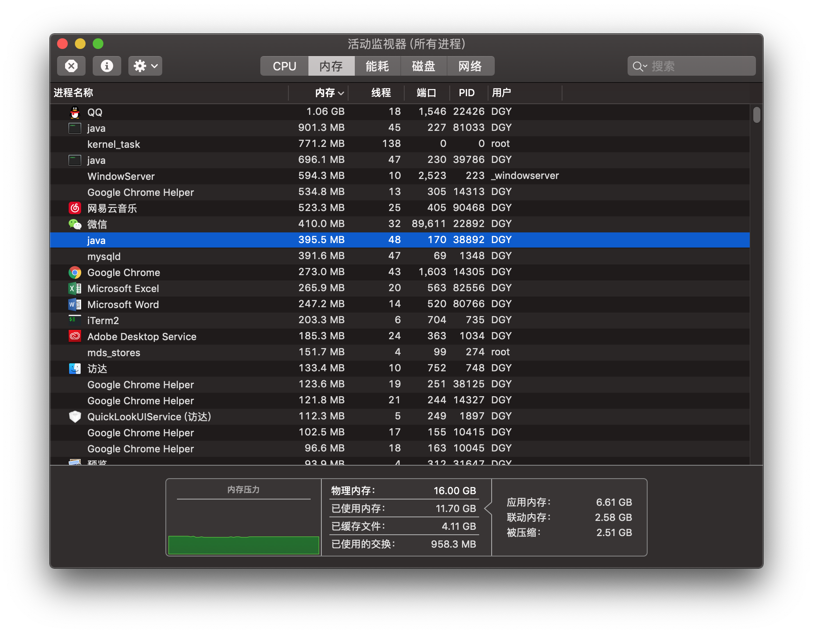
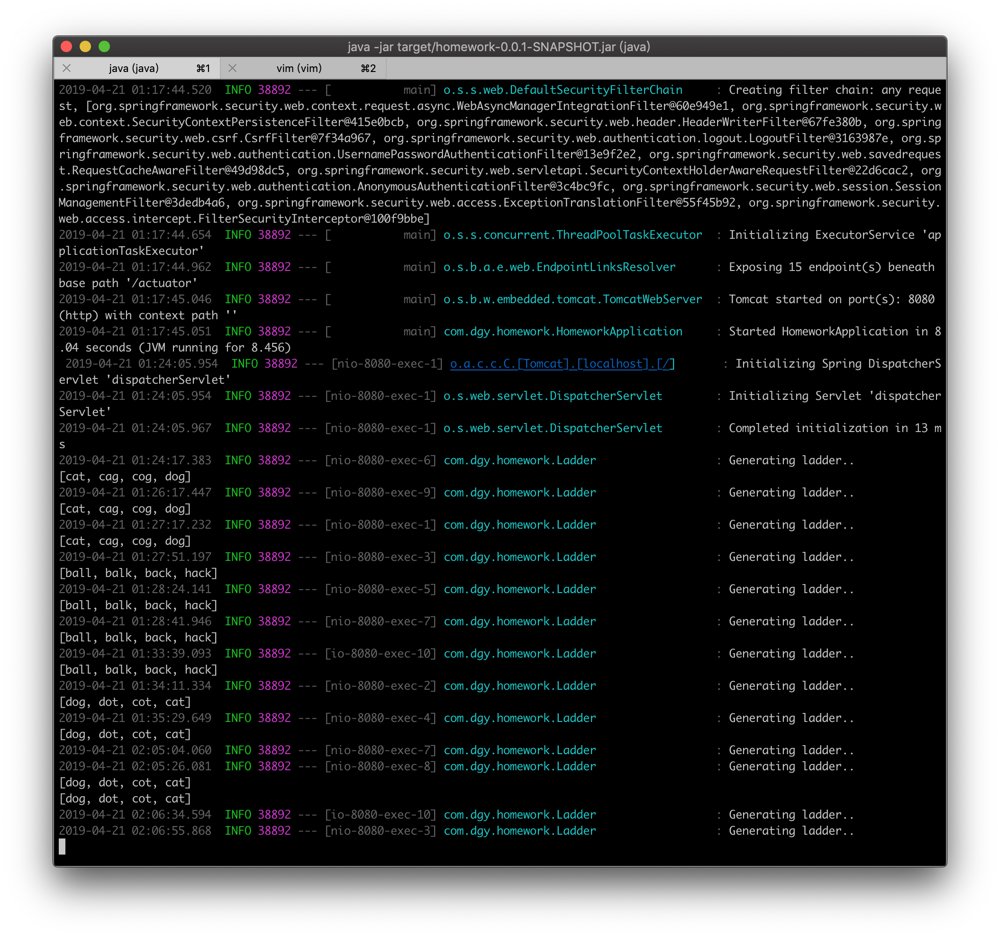

# Task 2
## The report for the resource consumption of my REST service






与内存消耗相比，CPU消耗更为明显。

在向后台发送了get请求后，cpu的用户占用率从5.24%增加到了17.20%。（请求方式为http://localhost:8080/ladder/cat&dog）

----

抛开REST请求的封装带来的资源消耗来直接观察WordLadder的实现（REST的封装带来的额外性能消耗远低于Ladder的生成过程）

```Java
public class Ladder{
	...

	private static ArrayList<String> generateDict(String filename){
		ArrayList<String> res = new ArrayList<String>();
		InputStream is = Ladder.class.getClassLoader().getResourceAsStream(filename);

        try {
			//String pathname = getDictPath("dictionary.txt");
			//FileReader reader = new FileReader(new File(pathname));
            //BufferedReader br = new BufferedReader(reader);
			BufferedReader br = new BufferedReader(new InputStreamReader(is));
         
            String line;
            while ((line = br.readLine()) != null) {
                //System.out.println(line);
				res.add(line);
            }
        } catch (Exception e) {
            e.printStackTrace();
        }

		return res;
	}
	
	private static ArrayList<String> generateLadder(String begin, String end){
		Queue<String> queue = new LinkedList<String>();
		ArrayList<String> words = generateDict("dictionary.txt");
		ArrayList<String> trace = new ArrayList<String>();
		ArrayList<String> res = new ArrayList<String>();
		Map<String,String> prev = new HashMap<String,String>();
		Map<String,Integer> dist = new HashMap<String,Integer>();
		   
		begin=begin.toLowerCase();
		end=end.toLowerCase();

		queue.offer(begin);
		trace.add(begin);
		dist.put(begin,0);
		String cur="";
		while(!queue.isEmpty()){
			cur=queue.poll();
			if(cur.equals(end))break;
			for(int i=0;i<cur.length();i++){
				for(char j='a';j<='z';j++){
					char[] arr=cur.toCharArray();
					arr[i]=j;
					String tstr=new String(arr);
					int curDist=dist.get(cur);
					int tDist;
					try{
						tDist=dist.get(tstr);
					}
					catch(NullPointerException e){
						tDist = Integer.MAX_VALUE;
					}
					if(words.contains(tstr)){
						if(trace.contains(tstr)){ 
							if(curDist+1 < tDist){
								dist.put(tstr,curDist+1);
								prev.put(tstr,cur);
							}
						}
						else{
							prev.put(tstr,cur);
							dist.put(tstr,curDist+1);
							queue.offer(tstr);
						}
						trace.add(tstr);
					}
				}
			}
		}
		
		if(!cur.equals(end)){
			System.out.println("Cannot generate a ladder.");
		}	
		else{
			res.add(cur);
			while(prev.get(cur)!=null){
				res.add(prev.get(cur));
				cur=prev.get(cur);
			}
		}
		return res;
	}

}
```

内存资源的占用主要来自于两个方面，一个是对字典内容的储存，另一个是bfs的中间过程记录。
分析算法后可知生成过程中的中间过程记录所占内存远低于字典内容的储存，而字典的大小为2.2MB。


通过之前的内存消耗截图比较甚至可发现与其余应用消耗来看几乎微乎其微。

----

在同时进行两个ladder生成请求时，可观察到内存依旧并无太多占用，而CPU占用再次显著的上升到28.41%





## 结论
对于该算法而言CPU的占用率显著高于内存占用率（相比于其他应用）
